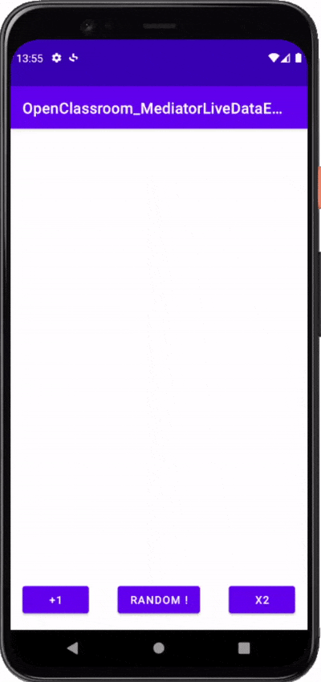

# OpenClassroom - MediatorLiveData - Example
Ce projet permet d'avoir un exemple d'une application **Android** écrite en **Java** avec une architecture **MVVM** simple, utilisant des
`LiveData`. Des **tests unitaires** et des **tests d'intégration** sont présents, utilisant respectivement `Mockito` et `Espresso` comme framework.

## Démo

## Présentation globale
Un `MediatorLiveData` est utilisé pour multiplier 2 nombres : le premier est incrémenté ou doublé par click sur un bouton,
le second est un nombre généré aléatoirement par click sur un bouton. Le résultat de l'opération et une phrase complexe est affiché à
l'utilisateur

## NB
Par soucis de simplicité, le `MainViewModel` n'a pas de référence au `Context` et ne concatène pas des `String` issues des Resources Android.
Il est important de noter que d'avoir des `String` "en dur" dans des fichiers Java est une très mauvaise pratique.
**A lire** : https://developer.android.com/guide/topics/resources/localization
